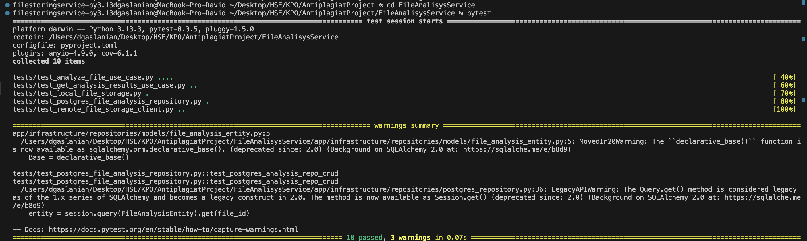
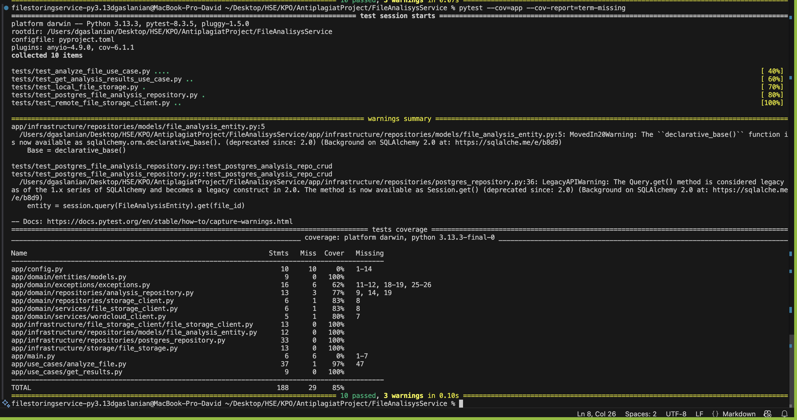

# Отчёт по File Analysis Service

## 1. Архитектура и слои (Clean Architecture)
- **Domain Layer (`app/domain`)**  
  – Сущности (`FileAnalysisModel`), исключения (`FileNotFoundException`, `StorageUnavailableException` и т.д.), репозитории и клиенты (`FileAnalysisRepository`, `FileStorageClient`, `WordCloudClient`).  
- **Use Cases Layer (`app/use_cases`)**  
  – `AnalyzeFileUseCase`: выполняет анализ, генерирует облако, проверяет хэш.  
  – `GetAnalysisResultsUseCase`: отдаёт SVG-файл облака слов.  
- **Infrastructure Layer (`app/infrastructure`)**  
  – `PostgresFileAnalysisRepository` (SQLAlchemy + PostgreSQL)  
  – `LocalFileStorageClient` (чтение `.txt`)  
  – `RemoteFileStorageClient` (HTTP-клиент к File Storing Service)  
  – `WordCloudClientImpl` (вызывает QuickChart API)  
- **Presentation Layer (`app/presentation/api`)**  
  – FastAPI-роуты (`analyze.py`, `results.py`), ручной DI через `get_analyze_file_use_case` и `get_results_use_case`.  

## 2. Принципы чистого кода
- **Single Responsibility**:  
  – `AnalyzeFileUseCase` — только анализ,  
  – `PostgresFileAnalysisRepository` — только CRUD,  
  – клиенты — только доступ к внешним ресурсам.  
- **Dependency Inversion**: бизнес-логика работает с интерфейсами клиентов и репозитория, конкретные реализации передаются извне.  
- **Open/Closed**: новые способы генерации облака или хранилища легко подключить через свои реализации `WordCloudClient` и `FileStorageClient`.  
- **Clear naming**: читаемые регулярки для разделения абзацев, аккуратные имена методов.

## 3. Реализация требований
1. **Получение текста**  
   – через `RemoteFileStorageClient` запрашиваем файл у File Storing Service.  
2. **Подсчёт статистики**  
   – абзацы, слова, символы.  
3. **100%-проверка (хэш)**  
   – SHA-256 хэш текста, `analysis_repo.find_by_hash` → сразу отдаём старый результат.  
4. **Облако слов (опционально)**  
   – `WordCloudClientImpl.generate(text)` → сохраняем SVG в папку `wordclouds/`.  
5. **Сохранение результата**  
   – метаданные и путь к SVG в PostgreSQL.  
6. **Выдача результата**  
   – возвращаем JSON с полями модели или стримим SVG через `/results/download`.  

## 4. Обработка ошибок
- **422 Unprocessable Entity** — неверный формат UUID  
- **404 Not Found** — `FileNotFoundException` (нет `.txt` или нет SVG)  
- **503 Service Unavailable** — `StorageUnavailableException` при недоступном File Storing Service  
- **500 Internal Server Error** — прочие ошибки  

## 5. Документация и API
- **Swagger UI**: `http://localhost:8001/docs`  
- **Postman**: коллекция `/postman/FileAnalysisService.postman_collection.json`  

## 6. Тесты и покрытие 
- Покрытие бизнес-логики Unit-тестами составляет 85 %, что больше требуемых 65 %
- Запуск (перейдя в директорию FileAnalisysService):
    
    - посмотреть покрытие тестами

  ```bash
  pytest --cov=app --cov-report=term-missing
  ```

    - посмотреть прохождение тестов

  ```bash
  pytest
  ```




