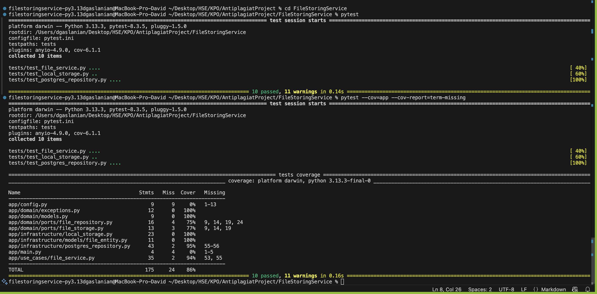

# Отчёт по File Storing Service

## 1. Архитектура и слои (Clean Architecture)
- **Domain Layer (`app/domain`)**  
  — Сущности (`FileModel`), специфичные исключения (`FileNotFoundException`, `FileAlreadyExistsException`, `InvalidFileFormatException`), порты (интерфейсы) `AbstractFileRepository` и `AbstractFileStorage`.  
- **Use Cases Layer (`app/use_cases`)**  
  — Класс `FileService`: содержит логику загрузки, дедупликации (то есть проверки на антиплагиат (файлы с таким же содержимым сохранить нельзя)), получения и удаления файла.  
- **Infrastructure Layer (`app/infrastructure`)**  
  — `LocalFileStorage` (файловая система), `PostgresFileRepository` (SQLAlchemy + PostgreSQL).  
- **Presentation Layer (`app/interfaces`)**  
  — FastAPI-роуты (`storage_router.py`), зависимость через ручной DI (`get_file_service`), перевод доменных исключений в HTTP-коды.  

## 2. Принципы чистого кода
- **Single Responsibility**: каждый класс отвечает только за своё (сервис, репозиторий, хранилище, контроллер).  
- **Dependency Inversion**: бизнес-слой зависит от абстракций, а не от конкретных реализаций.  
- **Open/Closed**: легко добавить другое хранилище или БД, не меняя `FileService`.  
- **Clear naming**: методы `upload_file`, `get_file`, `delete_file`, исключения `InvalidFileFormatException` и т.д. 

## 3. Реализация требований
1. **Загрузка `.txt`**  
   — проверка расширения (`.txt`), чтение контента, подсчёт SHA-256, дедупликация (сразу проверка на антиплагиат 100% - если совпадает содержимое с каким-то файлом, который уже сохранен - то новый файл сохранить не удастся - будет выдано сообщении о уже наличии файла с таким содержимым и ID этого файла).  
2. **Хранение**  
   — файл сохраняется в локальной папке (`/tmp`), метаданные — в PostgreSQL.  
3. **Выдача файла (возможность скачать файл)**  
   — стриминг через `StreamingResponse`.  

## 4. Обработка ошибок
- **415 Unsupported Media Type** — `InvalidFileFormatException`  
- **409 Conflict** — `FileAlreadyExistsException`  
- **422 Unprocessable Entity** — неверный UUID  
- **404 Not Found** — `FileNotFoundException`  
- **500 Internal Server Error** — непредвиденные ошибки  

## 5. Документация и API
- **Swagger UI**: `http://localhost:8000/docs`  
- **Postman**: коллекция `./postman/New Collection.postman_collection.json`  

## 6. Тесты и покрытие
- Покрытие бизнес-логики Unit-тестами составляет 86 %, что больше требуемых 65 %
- Запуск (перейдя в директорию FileStoringService):
    
    - посмотреть покрытие тестами

  ```bash
  pytest --cov=app --cov-report=term-missing
  ```

    - посмотреть прохождение тестов

  ```bash
  pytest
  ```

